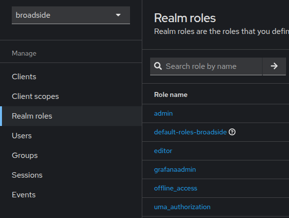
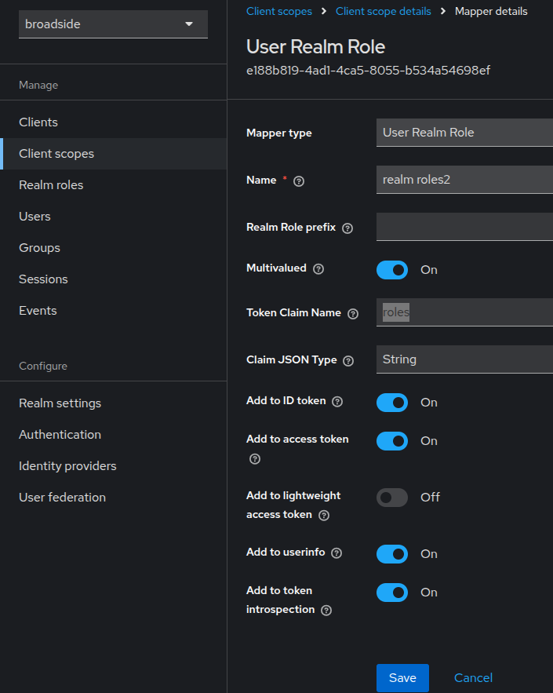
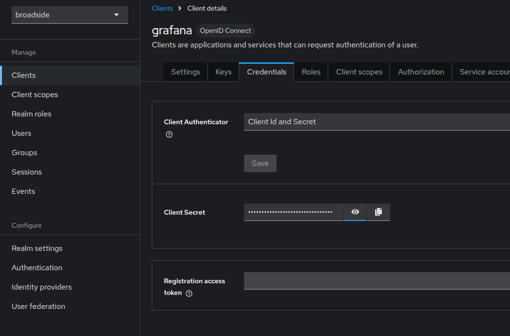
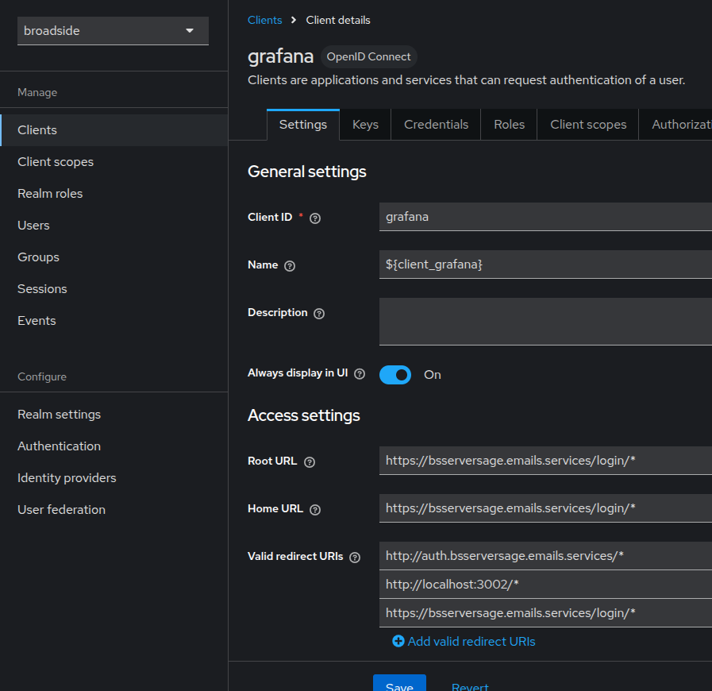
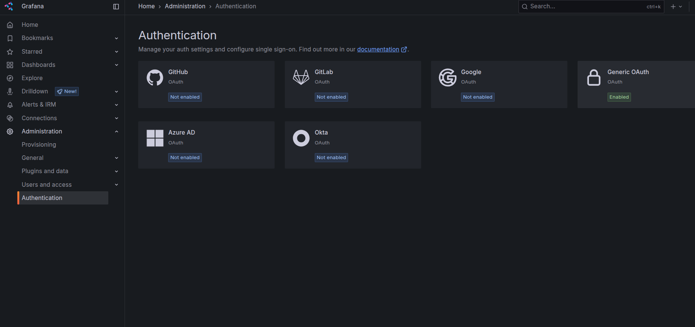
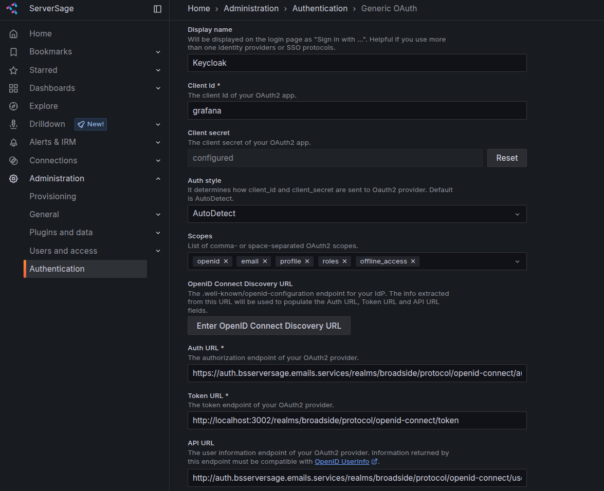

## Preruqusites:

1. Make sure grafana has domain attached and is accessible from targeted audence same for keyclaok
    assuming : grafana accesible from (bsserversage.emails.services) aand keycloak (auth.bsserversage.emaills.services)
    
## I. keycloak configuration part:
1. You need to give same domain as a hostname in keycloak as a variable parameter and restart the keycloak so that it will configure all internal linkes according to that which we will be using further

2. Create a realm which you are going to use for authentication for may case it is "broadside"
3. After realm creation please add "Realm roles" : editor, admin, grfanaadmin
    this roles will be feteched by grafana from token and same authority/rights will be given to that user in grafana.

    

4. Go to section "Client scopes" -> roles -> Mappers -> Add mapper (blue button) -> "By configuration" -> User Realm Role
5. Add details in `User Realm Role` as below & `Save`: 
    ```
    Token Claim Name : roles
    Add to ID token : On
    Add to access token : On
    Add to userinfo : On
    Add to token introspection : On
    ```
    

6. Go to Users and create few users and assign them the role which we have created in step 4.
7. Go to Clients -> create client 
    client id : grafana (you will be using same in grafana while linking keycloak)
8. After creation go to Clients -> grafana -> Credentials, and copy and save the client secret, we need this to tell grafana while making connection
    
    

9. You can add URL details if required

    

10. Now go to, Realm Settings -> OpenID Endpoint Configuration (keep this page open for reference in grafana configuration)

    

## II. grafana configuration part:

1. Login to grafana with grafanaadmin user and got to Administration -> Authentication -> Generic OAuth : 

    

2. Change the general setting as per step 11 and `save`: 

    


3. In the sign-out url section modify the url a little so that after sign-out it will redirect to your Grafana Login screen,
    focus on content from `?post_logout_redirect_uri` in below:
    ```
    https://auth.bsserversage.emails.services/realms/broadside/protocol/openid-connect/logout?post_logout_redirect_uri=https://bsserversage.emails.services/login
    ```
    
    

4. `User mapping` section do the the below changes and `save`: 
    
    `Role attribute strict mode` : On

    `Role attribute path` : contains(roles[*], 'grafanaadmin') && 'GrafanaAdmin' || contains(roles[*], 'admin') && 'Admin' || contains(roles[*], 'editor') && 'Editor' || 'Viewer'

    `Allow assign Grafana admin` : On

5. `Grafana Branding`: to do this you need to carefully choose the scripts mention in this [path](https://github.com/remiges-aniket/serversage/blob/main/remiges-asset/serversage.sh) and only run those sreept which needed with `root` user, make sure while changing logo images are present in both path mentioned with name.

    
