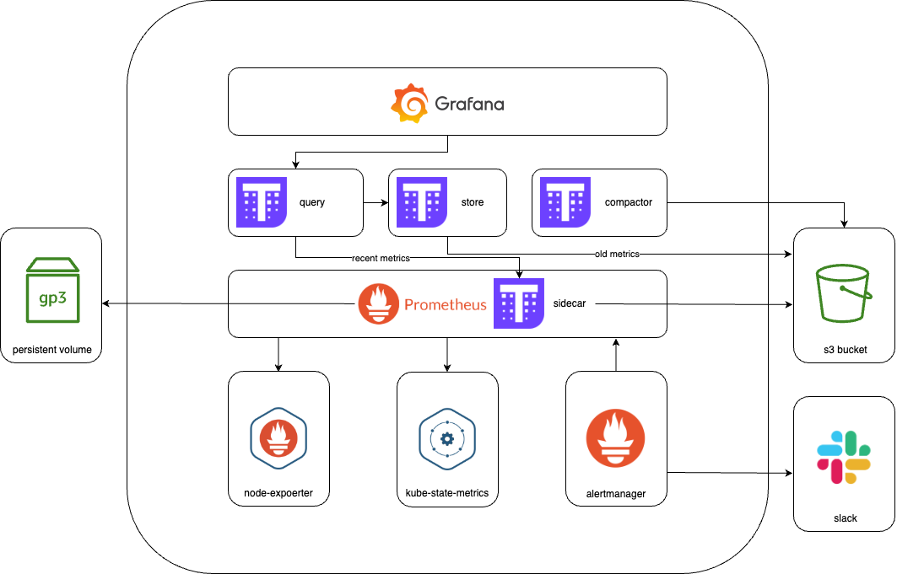

# Standard Operating Procedure: Prometheus High-Availability Setup

This document provides a Standard Operating Procedure (SOP) for deploying a Prometheus high-availability (HA) monitoring setup on Kubernetes, utilizing Prometheus Operator and Thanos.

The `slack`and `alertmanager` defined as a external or internal alert system:



## 1. Introduction 🎯

This SOP guides you through the installation and configuration of a robust Prometheus monitoring solution. It includes Prometheus Operator for managing Prometheus instances, Thanos for long-term storage and global querying, Node Exporter for host metrics, and various ServiceMonitors for discovering and scraping metrics from different services.

The setup is designed to be customizable for different environments, including considerations for private image repositories, storage configurations, and resource allocation.

## 2. Prerequisites 🛠️

Before you begin, ensure you have the following:

* **Kubernetes Cluster**: A running Kubernetes cluster (v1.20+ recommended).
* **`kubectl`**: The Kubernetes command-line tool, configured to communicate with your cluster.
* **Persistent Storage**:
    * Ability to create `hostPath` PersistentVolumes or have a dynamic provisioner for storage. This guide primarily uses manually provisioned `hostPath` PVs.
    * Ensure the specified `hostPath` directories exist on the relevant nodes or can be created.
* **Custom Docker Registry (Optional)**: If you use private image repositories, you'll need to update image paths in the YAML files and ensure your cluster has pull secrets configured.
* **MinIO or S3-compatible Object Storage**: Thanos requires object storage for long-term metric storage. The provided configuration includes a job to create a MinIO bucket, assuming MinIO is running and accessible at `http://minio.database.svc.cluster.local:9000`.
* **Prometheus CRD Files**: The script `0.init-crd.sh` refers to a `./crd/` directory. This directory should contain the Custom Resource Definition YAML files for Prometheus Operator (e.g., `prometheuses.monitoring.coreos.com`, `servicemonitors.monitoring.coreos.com`, etc.). These typically come with the Prometheus Operator documentation or release assets.

---

## 3. Setup Steps 🚀

Follow these steps to deploy the Prometheus HA setup:

### Step 1: Namespace Preparation

It's good practice to deploy monitoring components within dedicated namespaces. This configuration primarily uses the `serversage` namespace. The CRD installation script uses `serversage`, CRDs are generally cluster-scoped but let's create both as per files.

```bash
kubectl create namespace serversage # Used by the CRD installation script
```

### Step 2: Install Prometheus Custom Resource Definitions (CRDs)

The Prometheus Operator uses CRDs to manage Prometheus and related resources. The `0.init-crd.sh` script is used for this.

1.  Ensure you have the Prometheus Operator CRD files in a directory named `crd` relative to where you run the script.
2.  Make the script executable: `chmod +x 0.init-crd.sh`
3.  Run the script:

    ```bash
    ./0.init-crd.sh
    ```
    This script executes:
    ```sh
    #!/bin/bash
    # Fix Prometheus Operator setup

    echo "Step 1: Installing Prometheus CRDs directly..."

    # Assuming the CRD files are in a sub-directory named 'crd'
    # The script installs CRDs into the 'serversage' namespace.
    # CRDs are typically cluster-scoped, but this command specifies a namespace.
    # If CRDs are truly cluster-scoped, the -n flag is ignored for those.
    kubectl create -f ./crd/ -n serversage

    echo "Done! Check the status with: kubectl get prometheuses -n serversage"
    # Note: The Prometheus instance itself will be created in the 'serversage' namespace later.
    # To check for CRDs, you can use: kubectl get crds | grep 'monitoring.coreos.com'
    ```

### Step 3: Configure Storage (PersistentVolumes and StorageClasses)

This setup uses manually provisioned `PersistentVolumes` (PVs) with `hostPath`. This requires you to create directories on specific nodes in your cluster.

**⚠️ IMPORTANT**: `hostPath` volumes are suitable for single-node testing or specific setups where data locality on a particular node is acceptable. For production, consider using a distributed storage solution (e.g., Rook Ceph, GlusterFS, or cloud provider storage).

The following resources are defined in `2.pv-pvc-prometheus.yaml`:

* **StorageClasses**: `prometheus-storage` and `local-storage`. Both use `kubernetes.io/no-provisioner`, indicating manual PV creation.
* **PersistentVolume for Thanos Store Gateway**: Stores Thanos Store Gateway data.
* **PersistentVolumeClaim for Thanos Store Gateway**: Claims the PV for Thanos.
* **PersistentVolumes for Prometheus Instances**: Stores Prometheus time-series data.

**Customization for `2.pv-pvc-prometheus.yaml`:**

* **`hostPath`**: Modify the `path` under `spec.hostPath` for each `PersistentVolume` to point to valid directories on your Kubernetes worker nodes. Ensure these directories exist or can be created (`type: DirectoryOrCreate`).
    * Thanos Store: `/bse-data/data/monitoring/prometheus-ha/thanos-store`
    * Prometheus Instance 0: `/bse-data/data/monitoring/prometheus-ha/prometheus-0`
    * Prometheus Instance 1: `/bse-data/data/monitoring/prometheus-ha/prometheus-1` (This PV is for a second replica if you scale Prometheus to 2).
* **Storage Capacity**: Adjust `spec.capacity.storage` if needed.

Apply the storage configuration:

```bash
kubectl apply -f 2.pv-pvc-prometheus.yaml
```

Content of `2.pv-pvc-prometheus.yaml`:
```yaml
# Storage Classes
apiVersion: storage.k8s.io/v1
kind: StorageClass
metadata:
  name: prometheus-storage
provisioner: kubernetes.io/no-provisioner
volumeBindingMode: WaitForFirstConsumer
reclaimPolicy: Retain
---
apiVersion: storage.k8s.io/v1
kind: StorageClass
metadata:
  name: local-storage
provisioner: kubernetes.io/no-provisioner
volumeBindingMode: WaitForFirstConsumer
reclaimPolicy: Retain

---
# PersistentVolume for Thanos Store Gateway
apiVersion: v1
kind: PersistentVolume
metadata:
  name: thanos-store-gateway-data
  labels:
    app: thanos-store-gateway
spec:
  capacity:
    storage: 1Gi # Customize as needed
  accessModes:
  - ReadWriteOnce
  persistentVolumeReclaimPolicy: Retain
  storageClassName: local-storage
  hostPath: # Customize path
    path: /bse-data/data/monitoring/prometheus-ha/thanos-store # CHANGE THIS
    type: DirectoryOrCreate

---
# PersistentVolumeClaim for Thanos Store Gateway
apiVersion: v1
kind: PersistentVolumeClaim
metadata:
  name: thanos-store-gateway-data
  namespace: serversage # Ensure this matches the namespace of Thanos Store Gateway
spec:
  storageClassName: local-storage
  accessModes:
    - ReadWriteOnce
  resources:
    requests:
      storage: 1Gi # Customize as needed

---
# PersistentVolume for Prometheus instance 0
apiVersion: v1
kind: PersistentVolume
metadata:
  name: prometheus-prometheus-db-prometheus-0
  labels:
    app: prometheus
    prometheus: prometheus
    prometheus-instance: "0" # Label used by Prometheus Operator to match
spec:
  capacity:
    storage: 1Gi # Customize as needed
  accessModes:
  - ReadWriteOnce
  persistentVolumeReclaimPolicy: Retain
  storageClassName: prometheus-storage # Must match Prometheus CR's storageClassName
  hostPath: # Customize path
    path: /bse-data/data/monitoring/prometheus-ha/prometheus-0 # CHANGE THIS
    type: DirectoryOrCreate

---
# PersistentVolume for Prometheus instance 1 (for HA with 2 replicas)
apiVersion: v1
kind: PersistentVolume
metadata:
  name: prometheus-prometheus-db-prometheus-1
  labels:
    app: prometheus
    prometheus: prometheus
    prometheus-instance: "1" # Label used by Prometheus Operator to match
spec:
  capacity:
    storage: 1Gi # Customize as needed
  accessModes:
  - ReadWriteOnce
  persistentVolumeReclaimPolicy: Retain
  storageClassName: prometheus-storage # Must match Prometheus CR's storageClassName
  hostPath: # Customize path
    path: /bse-data/data/monitoring/prometheus-ha/prometheus-1 # CHANGE THIS
    type: DirectoryOrCreate

---
# Note: PVCs for Prometheus will be automatically created by Prometheus Operator
# with names like: prometheus-prometheus-db-prometheus-0
# These PVCs will bind to the PVs defined above if they match storageClassName and labels.
```

### Step 4: Deploy Prometheus Operator and Core Monitoring Components

The `1.prometheus-dep.yaml` file contains definitions for the Prometheus Operator, Prometheus custom resource (CR), Thanos components, Node Exporter, and necessary RBAC configurations and Services.

**Key Customizations for `1.prometheus-dep.yaml`:**

* **MinIO/S3 Endpoint and Credentials**:
    * In the `create-thanos-bucket` Job:
        * `myminio http://minio.database.svc.cluster.local:9000`: Update if your MinIO endpoint is different.
        * `minio minio123`: Update MinIO access key and secret key.
    * In the `thanos-objstore-config` Secret:
        * `endpoint`: Update to your MinIO/S3 endpoint.
        * `access_key` & `secret_key`: Update with your credentials.
* **Image Locations (Private Registry)**: If using a private registry, prepend your registry URL to all `image:` fields. Examples:
    * Prometheus: `baseImage: quay.io/prometheus/prometheus:v2.48.1`
    * Thanos: `baseImage: quay.io/thanos/thanos` (in Prometheus CR), `image: quay.io/thanos/thanos:v0.38.0` (in Thanos Deployments/StatefulSets)
    * Prometheus Operator: `image: quay.io/prometheus-operator/prometheus-operator:v0.71.0`
    * Config Reloader: `quay.io/prometheus-operator/prometheus-config-reloader:v0.71.0`
    * Node Exporter: `image: quay.io/prometheus/node-exporter:v1.6.1`
    * MinIO Client (mc): `image: minio/mc:RELEASE.2025-04-16T18-13-26Z`
* **Prometheus CR (`kind: Prometheus`)**:
    * `replicas: 1`: For **High Availability (HA)**, change this to `2`. Ensure you have a corresponding PV (`prometheus-prometheus-db-prometheus-1`) defined.
    * `retention: "1h"`: For production, increase this (e.g., `"30d"` or as per your policy). Thanos will handle long-term storage beyond this.
    * `storage.volumeClaimTemplate.spec.resources.requests.storage: 1Gi`: Adjust storage size per replica.
    * `runAsUser: 0`: The file notes `runAsUser: 1000` was considered. `0` is root. For security, prefer non-root if possible, but this might require changes to volume permissions or `fsGroup`. The current setup uses `0`.
    * `resources`: Adjust CPU/memory requests and limits for Prometheus and its Thanos sidecar.
* **Prometheus Operator Deployment**:
    * `resources`: Adjust CPU/memory (not specified in the file, consider adding).
* **Node Exporter DaemonSet**:
    * `resources`: Adjust CPU/memory requests and limits.
* **Thanos Querier Deployment**:
    * `replicas: 1`: For HA, consider increasing to `2`.
    * `resources`: Adjust CPU/memory requests and limits.
* **Thanos Store Gateway StatefulSet**:
    * `replicas: 1`: Typically 1-2 replicas are sufficient unless you have very high query load on historical data.
    * `resources`: Adjust CPU/memory requests and limits. These are set quite high (requests 3Gi memory).
    * `chunkPoolSize`, `indexCacheSize`: Adjust based on available memory and data volume.
    * `runAsUser: 0`: Similar to Prometheus, consider security implications.
* **Service NodePorts**:
    * `thanos-querier` Service uses `nodePort: 30017`. Change if this port is unavailable.
    * The commented-out `prometheus-operated` Service suggests `nodePort: 30018` for Prometheus UI. You can uncomment and use this.

Apply the main deployment file:

```bash
kubectl apply -f 1.prometheus-dep.yaml -n serversage
```
*(The Job `create-thanos-bucket` and the Secret `thanos-objstore-config` are also in the `serversage` namespace as per the YAML, so applying to `serversage` namespace is correct.)*

A summary of `1.prometheus-dep.yaml` structure:
```yaml
## Create MinIO bucket for Thanos (Job)
# Thanos Configuration Secret (Secret for objstore.yaml)
# Prometheus instance (CRD) - Production HA Setup (Prometheus CR)
# Prometheus Operator Deployment (Deployment)
# Prometheus Operator Service Account (ServiceAccount)
# Prometheus Operator ClusterRole (ClusterRole)
# Prometheus Operator ClusterRoleBinding (ClusterRoleBinding)
# Prometheus Service Account (ServiceAccount)
# Prometheus ClusterRole (ClusterRole)
# Prometheus ClusterRoleBinding (ClusterRoleBinding)
# Node Exporter DaemonSet (DaemonSet)
# Thanos Querier Deployment (Deployment)
# Thanos Store Gateway StatefulSet (StatefulSet)
# Services (thanos-querier, thanos-store-gateway, node-exporter)
# Potentially a commented out prometheus-operated Service (if you are not explicitly planning to expose to NodePort keep it commented after somepoint it will set to ClusterIp by CRD'S automatically)
```

### Step 5: Configure Additional Scrape Targets (Optional)

If you have applications exposing Prometheus metrics that cannot be discovered via ServiceMonitors (e.g., services outside Kubernetes or those without a Kubernetes Service), you can use static scrape configurations.

The `4.additional-scrap-config.yaml` file defines a Secret that holds these configurations.

**Customization for `4.additional-scrap-config.yaml`:**

* Edit the `prometheus-additional.yaml` key within the Secret:
    * `targets: ['192.168.1.10:8080']`: Replace with the actual IP addresses/hostnames and ports of your external applications.
    * Adjust labels (`env`, `service`) as needed.

Apply the additional scrape configuration Secret:

```bash
kubectl apply -f 4.additional-scrap-config.yaml -n serversage
```

Content of `4.additional-scrap-config.yaml`:
```yaml
---
# Secret for additional scrape configs
apiVersion: v1
kind: Secret
metadata:
  name: additional-scrape-configs
  namespace: serversage # Ensure this is the namespace where Prometheus CR is deployed
type: Opaque
stringData:
  prometheus-additional.yaml: |
    - job_name: 'external-application'
      static_configs:
        - targets: ['192.168.1.10:8080'] # CHANGE THIS to your external target(s)
          labels:
            env: 'external-datacenter'
            service: 'myapp'
---
```
This secret is referenced in the Prometheus CR under `spec.additionalScrapeConfigs`.

### Step 6: Define Service Monitors

`ServiceMonitors` are CRDs that tell the Prometheus Operator how to discover and scrape metrics from Kubernetes services. The `3.service-monitors.yaml` file provides several examples.

**Before applying `3.service-monitors.yaml`:**

* Ensure the target services and applications (Node Exporter, Kube State Metrics, MinIO, Redis Exporter, etc.) are deployed and are exposing metrics on the specified ports/paths.
* Verify that the `selector.matchLabels` in each `ServiceMonitor` correctly matches the labels of the target Kubernetes `Service` you want to scrape.
* Verify that `namespaceSelector.matchNames` points to the correct namespace(s) where the target services/exporters are running.

Apply the ServiceMonitors:

```bash
kubectl apply -f 3.service-monitors.yaml -n serversage
```
*(ServiceMonitors should be created in the same namespace as the Prometheus CR or in namespaces that Prometheus is configured to watch, if `serviceMonitorNamespaceSelector` is used in the Prometheus CR. The current Prometheus CR has `serviceMonitorSelector: {}`, which means it will select all ServiceMonitors in its own namespace (`serversage`)).*

A summary of `ServiceMonitors` in `3.service-monitors.yaml`:
* Node Exporter (in `serversage` namespace)
* Prometheus itself (for `operated-prometheus: "true"` label)
* MinIO (in `database` namespace)
* Kube State Metrics (in `kube-system` namespace)
* Redis Exporter (in `monitoring` namespace)
* Otel Collector (in `monitoring` namespace)
* Postgres Exporter (in `monitoring` namespace)
* Kafka Exporter (in `monitoring` namespace)
* Elastic Exporter (in `e-search` namespace)
* Keycloak (in `starmfv2-qa` namespace)
* ETCD (in `starmfv2-qa` namespace)

You may need to adjust the `namespaceSelector` or deploy these ServiceMonitors to the respective namespaces if your Prometheus Operator isn't configured to watch all namespaces for ServiceMonitors. However, the Prometheus CR has `serviceMonitorSelector: {}` which usually means it selects ServiceMonitors from its own namespace (`serversage`). If a ServiceMonitor needs to target a service in a different namespace, it uses `namespaceSelector` within the ServiceMonitor spec itself, which is the case for MinIO, KSM, etc.

---

## 4. Key Customization Areas (Summary) ⚙️

This section summarizes the most common areas you'll need to customize for your specific environment:

* **Image Locations**: Update all `image:` fields in YAML files if using a private Docker registry. (Files: `1.prometheus-dep.yaml`)
* **Storage Paths (`hostPath`)**: Modify `path` in `PersistentVolume` definitions. (File: `2.pv-pvc-prometheus.yaml`)
* **Storage Capacity**: Adjust `storage:` requests in PVs, PVCs, and `volumeClaimTemplate`. (Files: `1.prometheus-dep.yaml`, `2.pv-pvc-prometheus.yaml`)
* **Resource Requests and Limits**: Adjust `cpu` and `memory` for Prometheus, Thanos components, Operator, and Exporters. (File: `1.prometheus-dep.yaml`)
* **Namespace Adjustments**: While most components are in the `serversage` namespace, ensure this aligns with your strategy. CRDs are installed by script to `serversage`.
* **Replica Counts for HA**:
    * Prometheus CR: `spec.replicas` (e.g., 2 for HA).
    * Thanos Querier: `spec.replicas` (e.g., 2 for HA).
    * (File: `1.prometheus-dep.yaml`)
* **MinIO/S3 Endpoint and Credentials**:
    * `create-thanos-bucket` Job.
    * `thanos-objstore-config` Secret.
    * (File: `1.prometheus-dep.yaml`)
* **Prometheus Data Retention**: `retention` in Prometheus CR. (File: `1.prometheus-dep.yaml`)
* **External Scrape Configurations**: `targets` in `additional-scrape-configs` Secret. (File: `4.additional-scrap-config.yaml`)
* **NodePort Values**: If default NodePorts (e.g., 30017 for Thanos Querier) conflict, change them. (File: `1.prometheus-dep.yaml`)
* **ServiceMonitor Selectors**: Ensure `selector` and `namespaceSelector` in `ServiceMonitor` resources correctly target your services. (File: `3.service-monitors.yaml`)

---

## 5. Verification and Troubleshooting ✅

After applying the manifests, check the status of the deployed components:

1.  **Check CRDs**:
    ```bash
    kubectl get crds | grep 'monitoring.coreos.com'
    ```
    You should see CRDs like `prometheuses.monitoring.coreos.com`, `servicemonitors.monitoring.coreos.com`, `thanosrulers.monitoring.coreos.com`, etc.

2.  **Check Pods in the `serversage` namespace**:
    ```bash
    kubectl get pods -n prometheus -w
    ```
    Look for pods related to:
    * `prometheus-operator-...`
    * `prometheus-prometheus-...` (e.g., `prometheus-prometheus-0`, `prometheus-prometheus-1` if replicas=2)
    * `node-exporter-...` (one per node)
    * `thanos-querier-...`
    * `thanos-store-gateway-...`
    * `create-thanos-bucket-...` (should go to `Completed` status)

3.  **Check Prometheus Custom Resource instance**:
    Note: we have all CRD's required in `crd` folder.
    The Prometheus CR instance is deployed in the `serversage` namespace.
    ```bash
    kubectl get prometheuses -n serversage  # To see details and status
    ```

4.  **Check PersistentVolumeClaims (PVCs)**:
    ```bash
    kubectl get pvc -n serversage
    ```
    You should see PVCs like `prometheus-prometheus-db-prometheus-0` and `thanos-store-gateway-data` in `Bound` state.

5.  **Check Logs**: If pods are crashing or not ready, check their logs even if they are running primarly focus on (prometheus-operator, thanos-querier):
    ```bash
    kubectl logs -f <pod-name> -n serversage
    kubectl logs -f <pod-name> -c <container-name> -n serversage # If pod has multiple containers (e.g., Prometheus pods with thanos-sidecar)
    ```

6.  **Access User Interfaces (UIs)**:
    * **Prometheus UI** (Optional):
        If you uncommented the `prometheus-operated` service in `1.prometheus-dep.yaml` (which uses NodePort 30018 by default):
        Access via `http://<your-node-ip>:30018`
        Alternatively, you can port-forward:
        ```bash
        # Get the Prometheus service name (it might be prometheus-operated or similar)
        kubectl get svc -n serversage
        # Assuming the service is named 'prometheus-operated' and listens on 9090
        kubectl port-forward svc/prometheus-operated 9090:9090 -n serversage
        ```
        Then access `http://localhost:9090`.
    * **Thanos Querier UI** (Recommended):
        You need to check if we got the `targets` here, then only setup is successful.
        The `thanos-querier` service uses NodePort 30017 by default.
        Access via `http://<your-node-ip>:30017`
        Alternatively, port-forward:
        ```bash
        kubectl port-forward svc/thanos-querier 9090:9090 -n serversage # Querier also uses 9090 for HTTP
        ```
        Then access `http://localhost:9090`.

7.  **Check Prometheus Targets**:
    In the Prometheus UI, navigate to `Status -> Targets`. You should see the configured ServiceMonitors and static scrape configs as targets. Check their status.

8.  **Check Thanos Querier Stores**:
    In the Thanos Querier UI, navigate to the "Stores" page and `Status -> Targets`. You should see your Prometheus instances (via sidecars) and the Thanos Store Gateway listed.

---

This SOP provides a comprehensive guide to deploying your Prometheus HA setup. Remember to carefully review and customize the configurations to match your specific environment and requirements.

## Take a look at the successful deployment screenshot below.

 
 
 
---

### The external IP isn't connecting because no application is running there. My focus is purely on verifying if that IP is being added to the target list.

---
